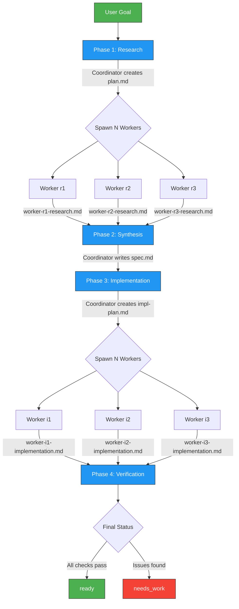
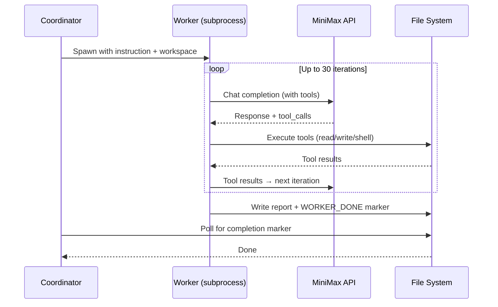

<p align="center">
  <h1 align="center">Agentic Coder</h1>
  <p align="center">
    A four-phase autonomous coding agent powered by MiniMax-M2.7
    <br />
    <a href="#quick-start"><strong>Quick Start</strong></a>
    &middot;
    <a href="INSTRUCTIONS.md"><strong>Hermes Integration Guide</strong></a>
    &middot;
    <a href="#architecture"><strong>Architecture</strong></a>
    &middot;
    <a href="#troubleshooting"><strong>Troubleshooting</strong></a>
  </p>
</p>

<p align="center">
  
  
  
  
  
  
</p>

---

## What is Agentic Coder?

Give it a goal in plain English. It researches your codebase, writes a spec, implements changes, and verifies the result — all autonomously with parallel workers.

- **Zero dependencies** — stdlib only, runs anywhere Python 3.9+ is installed
- **Parallel workers** — N subprocess agents work concurrently per phase
- **Full tool access** — workers read files, write files, run shell commands
- **Self-verifying** — Phase 4 checks every change against the spec
- **Hermes-native** — integrates with [Hermes Agent](https://github.com/DevvGwardo) ecosystem

---

## Architecture



### Worker Execution Model



---

## Quick Start

### 1. Set Environment Variables

```bash
export MINIMAX_API_KEY="your-api-key"
# Optional — defaults to http://localhost:4000
export MINIMAX_API_BASE="http://localhost:4000"
```

### 2. Run from CLI

```bash
python cli.py \
  "Refactor auth to support OAuth2" \
  --workspace ~/my-project \
  --max-workers 3 \
  --output /tmp/coder-result.json
```

### 3. Or Use from Python

```python
from agentic_coder import AgenticCoder, AgenticCoderConfig

coder = AgenticCoder(AgenticCoderConfig(
    workspace="/path/to/project",
    max_workers=3,
    verbose=True,
))
result = coder.run("Add rate limiting to the proxy endpoints")

print(result.final_status)  # "ready" or "needs_work"
print(result.spec)           # The implementation spec
print(result.scratch_dir)    # Where all artifacts live
```

> **Full Hermes integration?** See the [INSTRUCTIONS.md](INSTRUCTIONS.md) for cron jobs, heartbeat patterns, skill deployment, and more.

---

## CLI Reference

```
python cli.py <goal> --workspace <path> [options]
```

| Flag | Short | Default | Description |
|---|---|---|---|
| `goal` | _(positional)_ | required | Natural language coding task |
| `--workspace` | `-w` | required | Target codebase directory |
| `--scratch-dir` | `-s` | auto | Working directory for artifacts |
| `--max-workers` | `-n` | `3` | Parallel workers per phase |
| `--timeout` | `-t` | `10` | Worker timeout in minutes |
| `--output` | `-o` | — | Write result JSON to file |
| `--verbose` | `-v` | `True` | Verbose logging |
| `--quiet` | `-q` | `False` | Suppress logs |
| `--coordinator-model` | `-m` | `minimax` | `minimax` or `anthropic` |

**Exit codes:** `0` = ready, `1` = needs_work

---

## Configuration

### AgenticCoderConfig

| Field | Default | Description |
|---|---|---|
| `workspace` | _required_ | Project directory to operate on |
| `scratch_dir` | auto | Working directory for plans and reports |
| `max_workers` | `3` | Parallel workers per phase |
| `coordinator_model` | `MiniMax-M2.7` | Model for coordinator reasoning |
| `worker_model` | `MiniMax-M2.7` | Model for worker agents |
| `verbose` | `True` | Timestamped logs to stdout |
| `timeout_per_worker_minutes` | `10` | Force-kill workers after this |

### Environment Variables

| Variable | Default | Purpose |
|---|---|---|
| `MINIMAX_API_KEY` | — | MiniMax API key |
| `MINIMAX_API_BASE` | `http://localhost:4000` | MiniMax proxy URL |
| `HERMES_AGENTIC_CODER_DIR` | `/tmp` | Parent for auto-generated scratch dirs |

### Tuning Guide

| Scenario | Workers | Timeout | Notes |
|---|---|---|---|
| Small bug fix (1-3 files) | 2 | 5 min | Fast and focused |
| Medium feature (5-10 files) | 3 | 10 min | Default balance |
| Large refactor (10+ files) | 4-5 | 15 min | More parallel coverage |
| Codebase audit | 3 | 10 min | Research phase is key |

---

## How It Works

### Phase 1: Research

The coordinator breaks the goal into N independent investigation tasks. Workers explore the codebase in parallel using `read_file`, `list_dir`, `shell`, and `path_exists`. Each writes findings to `worker-*-research.md`.

### Phase 2: Synthesis

The coordinator reads all research findings and distills them into `spec.md` — a concrete, actionable specification with exact files, exact changes, and constraints.

### Phase 3: Implementation

The coordinator reads the spec and creates an implementation plan. Workers execute targeted code changes in parallel, each reporting to `worker-*-implementation.md`.

### Phase 4: Verification

The coordinator reviews all implementation reports against the spec. Reports pass/fail per item. Final status is `"ready"` or `"needs_work"`.

---

## Worker Tools

Workers use MiniMax native function calling. Five tools are available:

| Tool | Arguments | Returns | Limits |
|---|---|---|---|
| `read_file` | `path` | `{size, content}` | Content previewed at 500 chars |
| `write_file` | `path, content` | `{written, path}` | Creates parent dirs |
| `list_dir` | `path` | `{entries[], total}` | Max 50 entries |
| `shell` | `command, timeout?` | `{stdout, stderr, rc}` | stdout capped at 2000 chars |
| `path_exists` | `path` | `{path, exists, kind}` | kind: file/dir/missing |

---

## Output

### Result Object

```python
result.final_status    # "ready" or "needs_work"
result.scratch_dir     # Path to all artifacts
result.spec            # Spec text from synthesis
result.phases          # List[PhaseResult]
```

### Scratch Directory

```
scratch_dir/
  plan.md                       # Coordinator's research plan
  worker-r*-research.md         # Research worker findings
  spec.md                       # Implementation specification
  impl-plan.md                  # Implementation task assignments
  worker-i*-implementation.md   # Implementation worker reports
  verification.md               # Final pass/fail checklist
  worker-*.log                  # Worker subprocess stdout
```

### Inspecting Results

```bash
# Quick status
cat /tmp/agentic-coder-*/verification.md

# What workers found
cat /tmp/agentic-coder-*/worker-*-research.md

# Debug a stuck worker
tail -100 /tmp/agentic-coder-*/worker-r1.log
```

---

## MiniMax Quirks

Hard-won debugging lessons. Read before modifying the engine.

| Issue | Symptom | Fix |
|---|---|---|
| `reasoning_details` fallback | Empty coordinator outputs | Check `reasoning_details[0].text` when `content` is empty |
| Token budget exhaustion | Truncated responses | Use `max_tokens=8192` (4096 is too low) |
| Empty content with tool calls | `"chat content is empty (2013)"` | Omit `content` field entirely, don't send `""` |
| System-only + tools | HTTP 400 | Always include at least one user message |
| Nested triple backticks | Python 3.9 f-string error | Build prompts with `"\n".join([...])` |
| Tool result accumulation | Workers loop indefinitely | `max_tokens=8192` prevents truncation |

---

## Troubleshooting

<details>
<summary><strong>Workers produce empty reports</strong></summary>

MiniMax returns content in `reasoning_details` instead of `content`. The engine handles this, but check your proxy passes through the full response.

```bash
cat /tmp/agentic-coder-*/worker-r1.log | grep -i "error\|empty"
```
</details>

<details>
<summary><strong>Workers hit iteration cap (30/30)</strong></summary>

The worker ran out of iterations before completing. Usually means the task was too broad for a single worker, or `max_tokens` was too low.

```bash
grep "iteration" /tmp/agentic-coder-*/worker-r1.log | tail -5
```
</details>

<details>
<summary><strong>Connection refused to MiniMax API</strong></summary>

Your proxy isn't running or `MINIMAX_API_BASE` is wrong.

```bash
curl -s http://localhost:4000/v1/models
# If nothing: start your proxy
```
</details>

<details>
<summary><strong>Coordinator returns empty plan</strong></summary>

API key invalid, model name wrong, or proxy error. Test directly:

```bash
curl -s "$MINIMAX_API_BASE/v1/chat/completions" \
  -H "Authorization: Bearer $MINIMAX_API_KEY" \
  -H "Content-Type: application/json" \
  -d '{"model":"MiniMax-M2.7","messages":[{"role":"user","content":"hello"}],"max_tokens":10}'
```
</details>

<details>
<summary><strong>Scratch dir filling up disk</strong></summary>

```bash
# Remove runs older than 7 days
find /tmp -maxdepth 1 -name "agentic-coder-*" -mtime +7 -exec rm -rf {} +
```
</details>

---

## Known Issues

- Implementation workers occasionally hit the iteration cap (30) before writing reports
- Verification phase doesn't pre-read worker outputs (synthesis pattern not yet propagated)
- Complex multi-file changes may need a higher iteration cap

---

## Project Structure

```
agentic_coder/
  __init__.py          # Package exports: AgenticCoder, AgenticCoderConfig
  engine.py            # Core engine — coordinator + worker spawning
  cli.py               # CLI entry point
  SKILL.md             # Hermes skill manifest
  INSTRUCTIONS.md      # Full Hermes integration guide
  README.md            # This file
```

---

## Links

- [Hermes Integration Guide](INSTRUCTIONS.md) — Full instructions for cron jobs, heartbeat, skill deployment, and advanced usage
- [SKILL.md](SKILL.md) — Skill manifest with MiniMax quirks documentation
- [GitHub](https://github.com/DevvGwardo/agentic-coder) — Source code

---

## License

MIT
